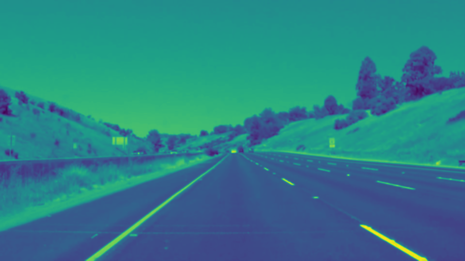
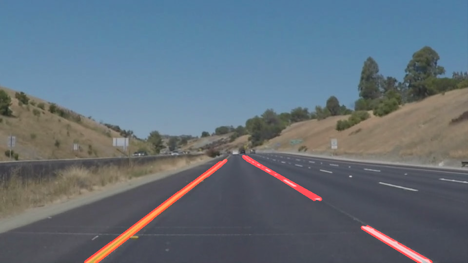

# **Finding Lane Lines on the Road** 

Overview
---

When we drive, we use our eyes to decide where to go.  The lines on the road that show us where the lanes are act as our constant reference for where to steer the vehicle.

In this project we will detect lane lines in images using Python and OpenCV.   

---

### The following techniques are used in the project.

### Grayscaling

This is an important first step in differentiating the lane lines from other objects on the road. I first converted the image to grayscale using "cv2.cvtColor(img, cv2.COLOR_RGB2GRAY)". An example is below:

### Gaussian Smoothing (Gaussian Blur)

The above grayscale images have many rough edges which causes many noisy edges to be detected. I used "cv2.GaussianBlur" to smooth out edges.

### Canny Edge Detection

Now I applied the Canny transform on the grayscale image with gaussian smoothing. We apply this transform in order to obtain the sharp edges of different objects in the image. 

### Region of Interest Selection

We need to isolate the edges for the left and right lanes from other objects in the image. In order to do this, we use "cv2.fillPoly" along with "cv2.bitwise_and" to isolate the portion of the image which is of interest to us. 

### Hough Transform Line Detection

I used Hough transform on the lane edge images to detect the lane lines.

### Extrapolating Lane Lines

In order to draw a single line on the left and right lanes, I modified the draw_lines() function by ...

### 2. Identify potential shortcomings with your current pipeline

One potential shortcoming would be what would happen when ... 

Another shortcoming could be ...

### 3. Suggest possible improvements to your pipeline

A possible improvement would be to ...

Another potential improvement could be to ...

Creating a Great Writeup
---
For this project, a great writeup should provide a detailed response to the "Reflection" section of the [project rubric](https://review.udacity.com/#!/rubrics/322/view). There are three parts to the reflection:

1. Describe the pipeline

2. Identify any shortcomings

3. Suggest possible improvements

We encourage using images in your writeup to demonstrate how your pipeline works.  

All that said, please be concise!  We're not looking for you to write a book here: just a brief description.

You're not required to use markdown for your writeup.  If you use another method please just submit a pdf of your writeup. Here is a link to a [writeup template file](https://github.com/udacity/CarND-LaneLines-P1/blob/master/writeup_template.md). 

