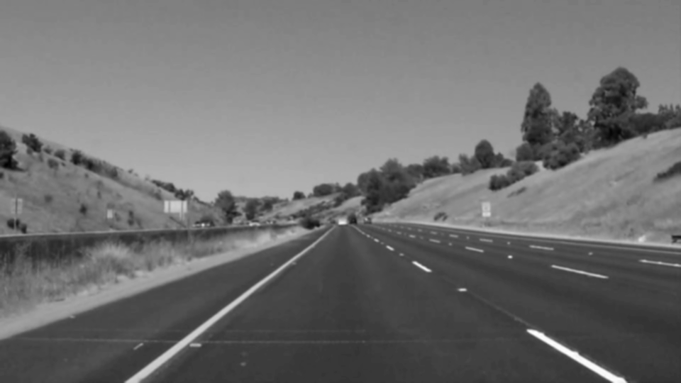
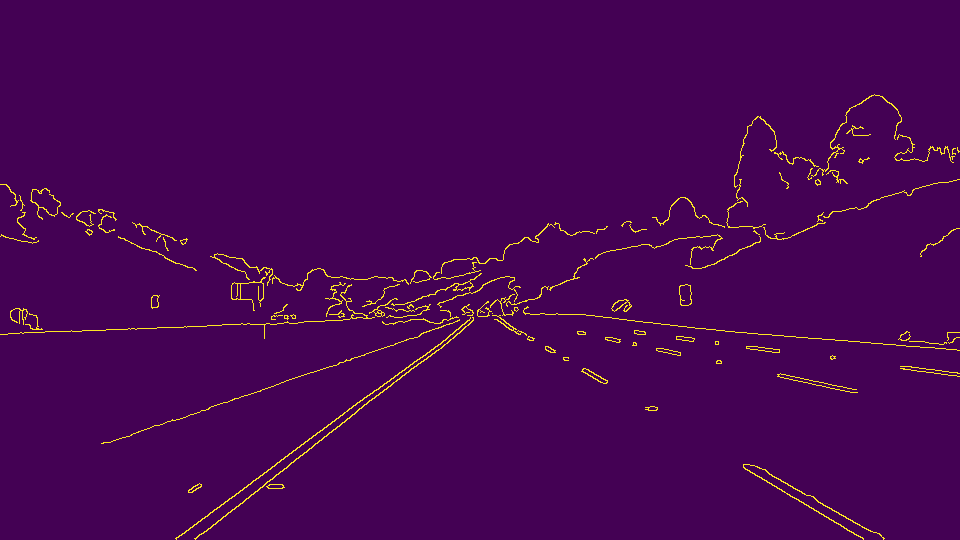
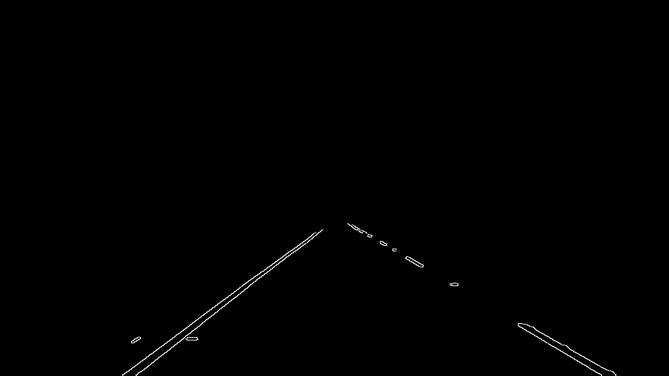

# **Finding Lane Lines on the Road** 

Overview
---

When we drive, we use our eyes to decide where to go.  The lines on the road that show us where the lanes are act as our constant reference for where to steer the vehicle.

In this project we will detect lane lines in images using Python and OpenCV.   

---

### The following techniques are used in the project.

### Grayscaling

This is an important first step in differentiating the lane lines from other objects on the road. I first converted the image to grayscale using "cv2.cvtColor(img, cv2.COLOR_RGB2GRAY)". An example is below:

### Gaussian Smoothing (Gaussian Blur)

The above grayscale images have many rough edges which causes numerous noisy edges to be detected. I used "cv2.GaussianBlur" to smooth out edges.

### Canny Edge Detection

Now I applied the Canny transform on the grayscale image with gaussian smoothing. We apply this transform in order to obtain the sharp edges of different objects in the image. 

### Region of Interest Selection

We need to isolate the edges for the left and right lanes from other objects in the image. In order to do this, we use "cv2.fillPoly" along with "cv2.bitwise_and" to isolate the portion of the image which is of interest to us. 

### Hough Transform Line Detection

I used Hough transform on the lane edge images to detect the lane lines.

### Extrapolating Lane Lines

In the previous image, we see that multiple lines are detected. In order to draw a single line on the left and right lanes, we need to average and extrapolate over the detected line segments. We seperate line segments by their slope ((y2-y1)/(x2-x1)) to decide which segments are part of the left line vs. the right line and take the averages.

### Video Clips

We draw lane lines on video clips using our detection techniques. The video inputs are in [test_videos](https://github.com/zeus2102/SDCND-finding-lane-lines/tree/master/test_videos) folder. 
The output video clips can be found in [test_videos_output](https://github.com/zeus2102/SDCND-finding-lane-lines/tree/master/test_videos_output) folder.

### Conclusion

The project was successful in simple lane detection using various computer vision techniques. The test images and videos with mostly straight and distinct lane images, helped with computation of the correct lines. Highly curved lines and steep road angles will pose more difficult challenges for lane detection in its current design. 

A possible improvement would be that we are able to detect how far the lane detection should extend on the road. This will help in case of steep or hilly road conditions. The color detection for the images also has scope for improvement in the current design. We can further isolate the lines by only detecting the colors (namely white and yellow) which are important in detecting the right lane lines in the image. 
